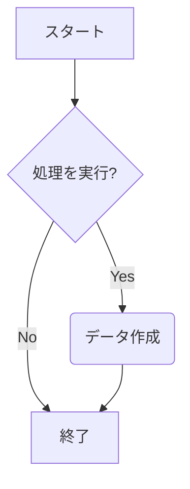
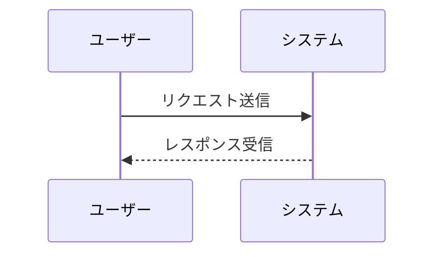
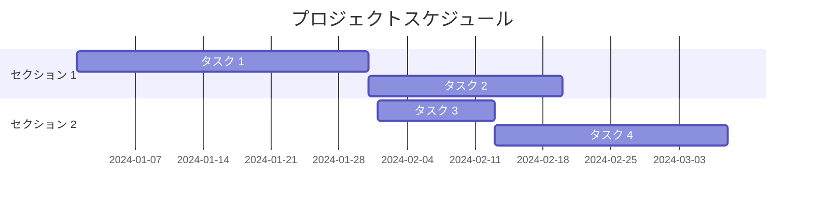
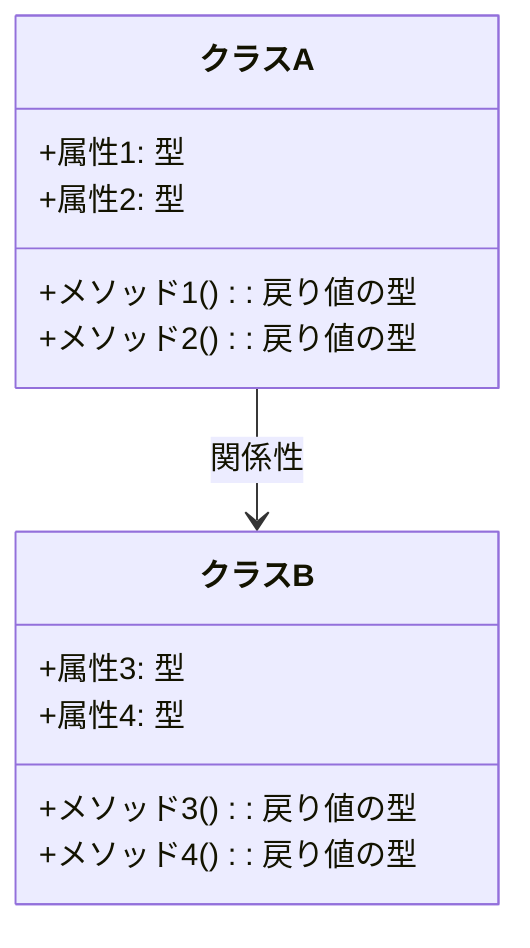

# 見出し 1
## 見出し 2 
### 見出し 3	
# 見出し 1 
## 見出し 2 
### 見出し 3	
# の数でレベルが変わります。（1〜6）
太字	
**太字**  
斜体	*斜体*  
太字と斜体	***太字と斜体***	太字と斜体	両方の強調を適用します。  

* 項目 1 
+ 項目 2 
- 項目 3
1. 項目 A 
2. 項目 B 
3. 項目 C

水平線
---

| 見出し 1 | 見出し 2 | 見出し 3 |
|----------|----------|----------|
| データ 1 | データ 2 | データ 3 |

表
データを整理して表示するために使用します。

 

'''